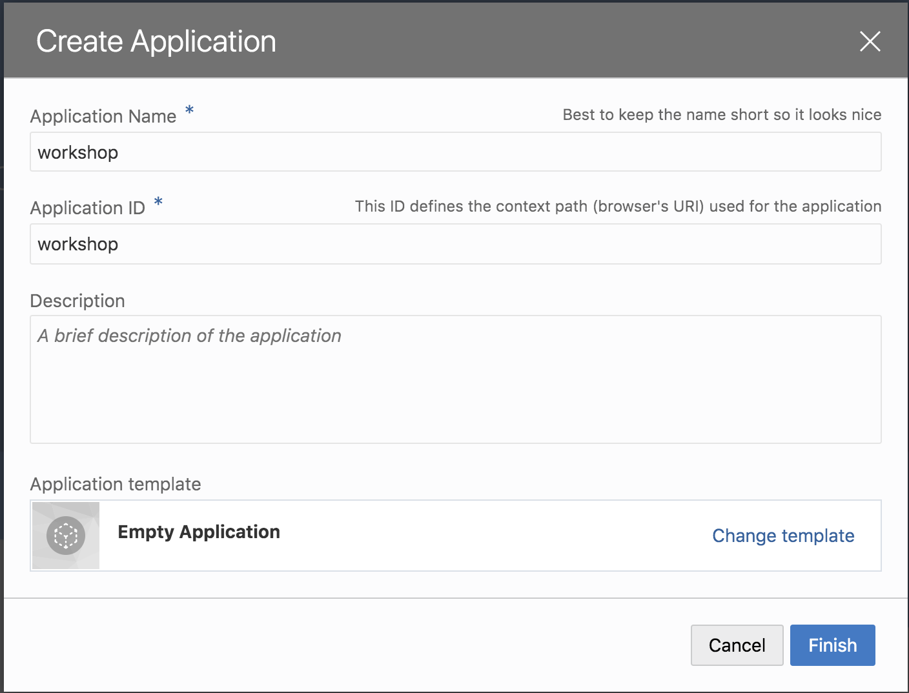
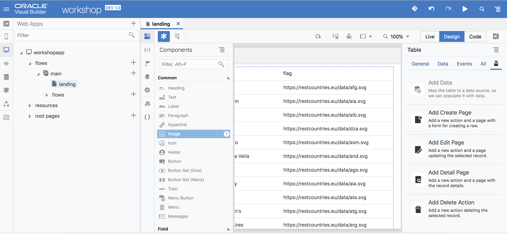
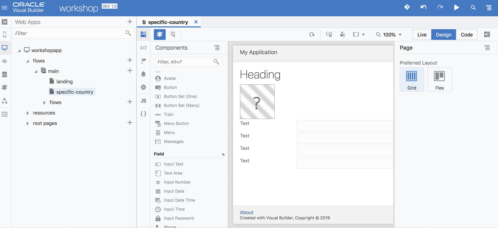
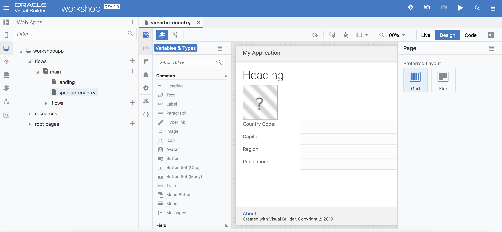
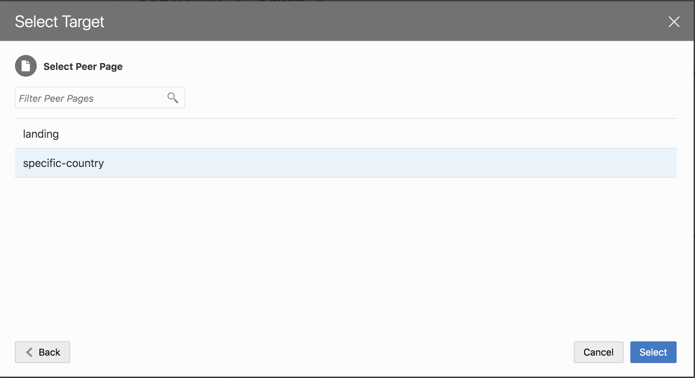

Updated: February 11, 2020

## Introduction

This is a workshop that will walk you through how to successfully create a fully functional web application using VBCS. The  workshop will walk you through many of the common features of VBCS that Developers often use. Specifically, the workshop will cover: 

- Drag-and-Drop UI Design
- REST API configuration 
- Action Chain configuration
- Data Flow within VBCS

**_To log issues_**, click here to go to the [github oracle](https://github.com/oracle/learning-library/issues/new) repository issue submission form.

## Objectives

For this workshop, we will create a Web Application that displays a list of countries' information. The information that we will be using comes from a public country API that can be found at https://restcountries.eu/#api-endpoints-all. The finished
product has 2 screens, and looks like so:

There are a couple of things that need to be done for this project. We need to:

- Build a Front-End
- Configure REST API connections
- Implement logic using Action Chains
- Manage Data Flow through a combination of Variables, Event Listeners and Action Chains

## Required Artifacts

The following lab requires an Oracle Cloud account as well as an instance of VBCS already created

## Create the Web Application Project

### **STEP 1**: Create a New Project

- On the main menu of VBCS, click the `+ New Application` button

- Enter a name for the application, then click `Finish`

- Now that we've successfully created a new Project, we can begin to create the actual web application itself. Click on the `Desktop icon` on the left side below the Phone icon, then hit the `+ Web Application` button. For the purposes of this workshop, we will be creating a Web application, **NOT** a Mobile application

- Enter a name for the web application, then click `Create`

- With the web application now created, expand the `Flows` hierarchy. Right click the `main-start` file and rename it to `landing`. This will be the landing page for our app (alternatively, think of it as an index.html file for any other app you may have built)

- Additionally, create a new file by pressing the `+` button, and naming the page `specific-country`.

- The wep application has been successfully set up at this point. Before we begin building the Front End UI, let's set up our REST connection.

### **STEP 2**: Create the REST API Connection

With our web application structure set up, we can now set up our REST connection. Specifically, our app will be consuming information from this link: https://restcountries.eu/#api-endpoints-all. Essentially, what we need are two endpoints from this server: an endpoint that returns **all** countries' information, and an endpoint that returns information for a **specific** country.

Setting up the GET endpoint for all countries:

- Click on the `Service Connections` tab on the left, and hit `+ Service Connection`

- Click `Define by Endpoint`

- Enter `https://restcountries.eu/rest/v2/all` into the URL input, then click `Next`

- Rename the `Service Name` to `Countries`

- In the `Test` tab, click `Send` and verify that the status code returned is 200. Then, click `Copy to Response Body`, ignoring any warning messages that may pop up. Finally, click `Create`. Your screen should look like the image below:

- We've successfully set up our endpoint that returns information for all countries. Let's set up the endpoint that returns information for a *specific* country now.

Setting up the GET endpoint for a specific country:

- Follow the same steps above, but instead for the URL input, enter: `/name/{countryName}`

- In the `Action Hint` selection box, change the value from `Get Many` to `Get One`, then verify that the connection has been successfully set up with the string `Afghanistan` (similar to above, you should get a 200 code). Again, click `Copy Response to Body`, then click `Add`

- Verify that your connections look like the following:

### **STEP 3**: Create the Frontend for the Landing Page

Now that we've properly configured our REST connections, let's start creating our frontend

- In the Components section on the Landing page, drag over a `Table` component. This component will be the main way we organize our data that we receieve from the GET ALL COUNTRIES endpoint

- `Left click` the table element, and click `Add Data` on the right side

- Select the `/all` endpoint, then hit `Next`

- From the Endpoint Structure, we select the fields that we want to display onto our frontend. Select `alpha2code`, `name`, `capital`, and `flag` *in that order*. Additionally, set the primary key to be `alpha2code`, then select `Next`

- Click `Finish`

- The page should look like this: 

- Now that the table has data on it, we need to fix the `flag` column. We want the image of the flag to be shown instead of the URL for that image, so drag over an `Image` component onto that column. An image box should appear. In the `Data` tab for that image, enter `{{ $current.row.flag }}`

- Preview the application to see the changes take effect by clicking the `Play` button icon in the top right corner. At this point, the page should look like the following:

- The images are quite big, so let's resize them. In the `General` tab, set the `width` and `height` to 70.

- Next, let's fix some of the styling on the page. Rather than displaying "alpha2code" for the column, let's fix that column to display "Country Code" instead. Under the `data` option for the table, click on the `Edit` icon for `Table Columns`. Modify the `headerText` field to be `Country Code`

- Let's now make the font bold for that specific column. In the `all` tab in the `columns` section, click the `right arrow sign`. In the `columns.header-style` box, enter `font-weight: bold`. In this way, we our adding in our own CSS to style this page

- Perform the last two steps for **all** columns to get this outcome:

- This page looks good to go. The next thing we need to add is some logic that handles what happens when a user clicks on a row. When a user clicks on a row, we want to redirect that user to another page with more details about that country. We will handle this in the next section.

### **STEP 4**: Create the Frontend for the Specific Country Page

- Drag over a `Heading`, `Image` and 4 `Input Text` components to the page. At this point, the specific-country page should look like so:

- Click on the `Labels` that you created (each Input Text element consists of a Label and an input value box), and change the `Text` property of each one to `Country Code:`, `Capital:`, `Region:`, and `Population:`. The page should now look like so:

- With the layout of the page created, now we have to assign the value of each input box to information that we receieve from the previous "landing" page. To pass data from one page to the next, we use `variables`. Click the `Variables & Types` section of the page.

- Click `+ Variable`, and create 4 new variables called `countryName` (String), `countryCode` (String), `countryCapital` (String), `countryRegion` (String), `countryPopulation` (Number) and `countryFlagURL` (String). 

- Make sure that the variable `countryName` has `enabled` marked for the `Input Parameter` section. Marking this as enabled means that we are passing the `countryName` variable from one page to the next (in this case we are passing the countryName variable from the landign page to the specific country page)

(extra image here)

- Let's next assign the values of those input boxes to the variables we just created. For each `Input Text` element, set the value to the variable we created (i.e the `Country Code` label's input text should be binded to the `countryCode` variable). In the `data` tab, enter the name of the variable like below. Repeat this for the other 3 `input text` boxes. Afterwards, check the `Readonly` component, since this box will only be used to display information instead of accepting input 

- For the `Heading` component, change its data value to match the `countryName` variable

- For the `Image` component, set the `width` to 450 and `height` to 350. Additionally, in the `data` column, change the value to the `countryFlagURL` variable

- This page has been successfully configured to receive any data passed to it from the Landing page. 

### **STEP 5**: Create the Logic that will pass information from the Landing page to the Specific Country Page

- We want to implement logic that handles what happens when a user clicks on a row in our Landing page table. To do this, navigate to the Landing page. Click on the table, and in the `Events` tab, click `+ New Event` and click on `Quick start: first-selected-row`. This will automatically bring forward an action chain

- Drag over a `Navigate` component to the chain

- Click `Select Target` and `Peer Page`

- Select the `specific-country` page and then click `Select`

- Click `assign`

- Map `rowData` to the `countryName` parameter. Modify the box below to include only the clicked-on country's **name** only, then click `Save`. The reason why we are passing only the **name** attribute and not every other attribute is because we need this attribute to call our specific country API

- Test out the application by clicking the `Play` icon on the top right corner. Try clicking on the first row, which should give you this result:

Great! The name is successfully passed, but all of the other information wasn't. What gives? Well, so far we've only passed the Country's name attribute to the page. We'd like to pass the other fields as well, but we **can't** because we actually dont have all of that information the (i.e. country's region or population). So what we need to do is actually pass in this *name* attribute we got from the first page and make another GET request to our specific country API. So what do we have to do next? Let's create an `Action Chain` that is run everytime the specific-country page is loaded. The purpose of this action chain is to call on our specific country endpoint.
  
- On the specific-country page, select the `Events` tab, then click on `+ Event Listener`

- Select `vbEnter`

- Click the `+` icon next to "Page Action Chains". Let's call this chain `getCountryDetails`. Click `Select`

- In the `Action Chains` tab, click on the newly created chain

- Drag over a `Call Rest Endpoint` component, then click on `Select Endpoint`

- Under Service Connections, select the `/{countryName}` endpoint

- Click on the red `Not Mapped` button, perform the following mapping and then click save:

- Now we have to handle what happens when the GET request is successfuly performed. On a successful call, we want to map the response of that request to the variables we made, which should then update the input values on the specific-country page. Drag over an `Assign Variables` component to the chain

- Click `Assign`, and then perform the mapping from the response of the request (left hand side) to the variables we want to hold their value on the right hand side

- Test out the application using the `Play` icon in the top right corner. You should have two pages, as shown below:

- Great! The app is now finished. If you'd like to change the way things are laid out on the page feel free to play around with any CSS properties (i.e. padding, center components, etc.) as well, but at this point you have a fully functional web app.

### **Summary**

*So what did we do?* 

- First, we created our new project, then created an app within that project. We created two pages for our app: one for all our countries, and another for a specific country

- Then, we created our REST connections that we needed to get information for countries in the `Service Connections` tab of VBCS

- After that, we created our Front End. We used a `Table` component as a way to manage our data for the `Landing` page, and a combination of headers, images, labels and input text for our `specific-country` page

- Finally, we used a combination of `Variables`, `Event Listeners` and `Action Chains` to propogate data from one page to the next within a VBCS app

You did it! You are now a VBCS expert, and are ready to demo the basics of this tool to customers :)
